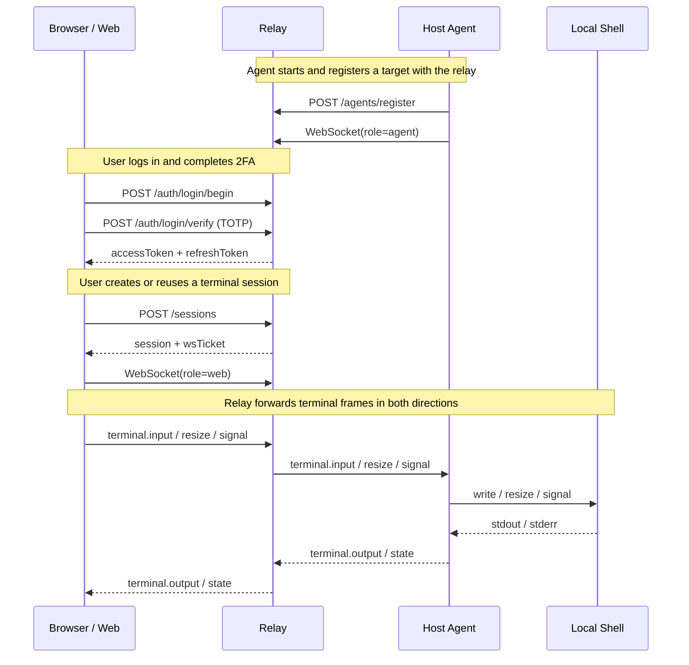

# CCMT

> A remote terminal control project that exposes a host shell to the browser through a relay service.

[中文 README](./README.md)

## What is CCMT?

CCMT is a `pnpm workspace` monorepo for remote terminal control. It splits terminal access into three main pieces:

- `web`: the browser-based console
- `relay`: the authentication, session, and forwarding layer
- `host-agent`: the terminal-side agent running on the target machine

The repository already wires up the basic end-to-end flow: login, TOTP-based 2FA, target registration, session creation, WebSocket terminal forwarding, and relay state persistence.

## What can it be used for?

- accessing a shell on a selected host from the browser
- placing authentication and session control in front of remote terminal access
- serving as a minimal runnable reference for a “web console + relay + agent” architecture
- evolving into a multi-target, multi-user, permission-aware remote operations console

## Highlights

- username / password + TOTP two-factor authentication
- first-time owner bootstrap
- access token / refresh token / WebSocket ticket auth flow
- persisted relay auth and session state
- host-agent publishing a local shell as a connectable target
- browser terminal page with connection, reconnection, scrollback, and basic controls
- bilingual UI support

## UI Preview

The repository does not yet include official screenshots, so this README reserves screenshot slots that can be filled later.

| Screen | Description | Reserved Path |
| --- | --- | --- |
| Login / First-time setup | user login, owner bootstrap, TOTP setup | `docs/images/login.png` |
| Dashboard | target list, user info, initialization entry | `docs/images/dashboard.png` |
| Terminal | remote terminal session in the browser | `docs/images/terminal.png` |

> These image files are not created yet. The table is only reserving the display locations for the README.

## End-to-End Flow



## Quick Start

### 1) Requirements

Recommended versions:

- Node.js `20+`
- pnpm `10+`

If pnpm is not installed yet:

```bash
corepack enable
corepack prepare pnpm@10.30.3 --activate
```

### 2) Install dependencies

From the repository root:

```bash
pnpm install
```

### 3) Prepare environment variables

Copy the template:

```bash
cp .env.example .env
```

Then export the variables into your current shell:

```bash
set -a
source .env
set +a
```

### 4) Start all services

```bash
pnpm dev
```

### 5) Open the web console

```text
http://localhost:3000
```

### 6) Recommended first-time flow

1. Open the login page.
2. Click “First time setup”.
3. Create the owner username and password.
4. Save the returned TOTP data and add it to an authenticator app.
5. Go through login using username, password, and a device label.
6. Enter the 6-digit TOTP code.
7. After login, enter the dashboard.
8. Open the terminal for the target you want.

## Installation and Startup

### Start the whole project at once

```bash
pnpm install
cp .env.example .env
set -a
source .env
set +a
pnpm dev
```

### Start services separately

#### relay

```bash
set -a
source .env
set +a
pnpm --filter @ccmt/relay dev
```

#### host-agent

```bash
set -a
source .env
set +a
pnpm --filter @ccmt/host-agent dev
```

#### web

```bash
pnpm --filter @ccmt/web dev
```

Default endpoints:

- Web: `http://localhost:3000`
- Relay HTTP: `http://localhost:8787`
- Relay WebSocket: `ws://localhost:8787/ws`

## One Important Gotcha

In the current codebase:

- `apps/relay`
- `apps/host-agent`

read directly from `process.env` and **do not automatically load the root `.env` file**.

So if you only run `cp .env.example .env` but never `source` it into your shell, relay and host-agent will still not see those values.

That is why this command sequence is called out explicitly throughout the README:

```bash
set -a
source .env
set +a
```

## Module Guide

### `apps/web`

Responsible for:

- owner bootstrap
- login, TOTP verification, and token refresh
- displaying target / session / device data
- creating or reusing terminal sessions
- opening the browser WebSocket terminal connection

### `apps/relay`

Responsible for:

- APIs such as `/auth/*`, `/targets`, `/sessions`, and `/agents/register`
- issuing and verifying user tokens, refresh tokens, WS tickets, and agent tokens
- tracking target and session state
- storing scrollback
- persisting relay state to disk

Default state file:

```text
./.ccmt/relay-state.json
```

### `apps/host-agent`

Responsible for:

- registering with the relay using the enroll secret
- opening the agent WebSocket connection
- spawning a local shell
- forwarding terminal output and receiving input / resize / signal events

The current implementation publishes one target by default:

- `CCMT_TARGET_ID`, default: `claude-main`
- `CCMT_SHELL`, default: `/bin/bash`

### `packages/protocol`

Responsible for:

- shared message frame definitions
- terminal input / output / resize / signal / state / error schema
- reducing protocol drift across web, relay, and host-agent

## Common Commands

From the repository root:

```bash
pnpm dev
pnpm build
pnpm typecheck
pnpm lint
pnpm test
```

Run a single workspace:

```bash
pnpm --filter @ccmt/web dev
pnpm --filter @ccmt/relay build
pnpm --filter @ccmt/host-agent typecheck
pnpm --filter @ccmt/protocol build
```

## Environment Variables

These are the main environment variables used by the current code.

| Variable | Purpose | Default |
| --- | --- | --- |
| `CCMT_RELAY_PORT` | relay HTTP port | `8787` |
| `CCMT_WS_PATH` | relay WebSocket path | `/ws` |
| `CCMT_TOKEN_SECRET` | signing secret for user tokens and WS tickets | `ccmt-dev-secret` |
| `CCMT_AGENT_ENROLL_SECRET` | shared secret for host-agent registration | `ccmt-agent-enroll-dev` |
| `CCMT_RELAY_STATE_FILE` | relay persistence file path | `./.ccmt/relay-state.json` |
| `CCMT_RELAY_STATE_DEBOUNCE_MS` | debounce before relay state is persisted | `500` |
| `CCMT_WEB_RELAY_HTTP_URL` | relay HTTP URL used by host-agent | `http://localhost:8787` |
| `CCMT_WEB_RELAY_WS_URL` | relay WS URL used by host-agent | `ws://localhost:8787/ws` |
| `CCMT_AGENT_ID` | host-agent ID | `host-dev` |
| `CCMT_TARGET_ID` | published target ID | `claude-main` |
| `CCMT_SHELL` | local shell launched by host-agent | `/bin/bash` |
| `NEXT_PUBLIC_CCMT_RELAY_HTTP_URL` | relay HTTP URL used by the browser | `http://localhost:8787` |
| `NEXT_PUBLIC_CCMT_RELAY_WS_URL` | relay WS URL used by the browser | `ws://localhost:8787/ws` |

### Optional: seed an owner at startup

The current code also supports these optional variables:

- `CCMT_OWNER_USERNAME`
- `CCMT_OWNER_PASSWORD`
- `CCMT_OWNER_TOTP_SECRET`

If all three are present, the relay creates an owner account automatically on startup.

## Repository Structure

```text
.
├── apps/
│   ├── host-agent/
│   ├── relay/
│   └── web/
├── packages/
│   └── protocol/
├── .env.example
├── .gitignore
├── package.json
├── pnpm-lock.yaml
├── pnpm-workspace.yaml
├── tsconfig.base.json
├── README.md
└── README.en.md
```

## Troubleshooting

### No target appears in the browser

Check:

- whether the relay is running
- whether the host-agent is running
- whether `CCMT_AGENT_ENROLL_SECRET` matches on both sides
- whether the relay URLs are configured correctly

### Login works but terminal cannot be opened

Check:

- whether the target is online
- whether the current user has `terminal:write` permission
- whether the session was created successfully
- whether the browser is using the right relay HTTP / WS URLs

### Relay state disappears after restart

Check:

- whether `CCMT_RELAY_STATE_FILE` points to a writable location
- whether `.ccmt/relay-state.json` was deleted
- whether the relay exited before it could flush state

## Current Status

The repo already has a full basic flow, but it is still closer to an extensible MVP than a finished platform:

- `lint` and `test` are still placeholders in most packages
- user and permission management are still basic
- host-agent currently publishes only a single shell target
- deployment, monitoring, and production configuration docs are still limited

If you continue development, natural next steps include:

- automated tests
- lint / formatting standards
- multi-target / multi-session support
- finer-grained permissions beyond viewer / owner
- deployment and production configuration
