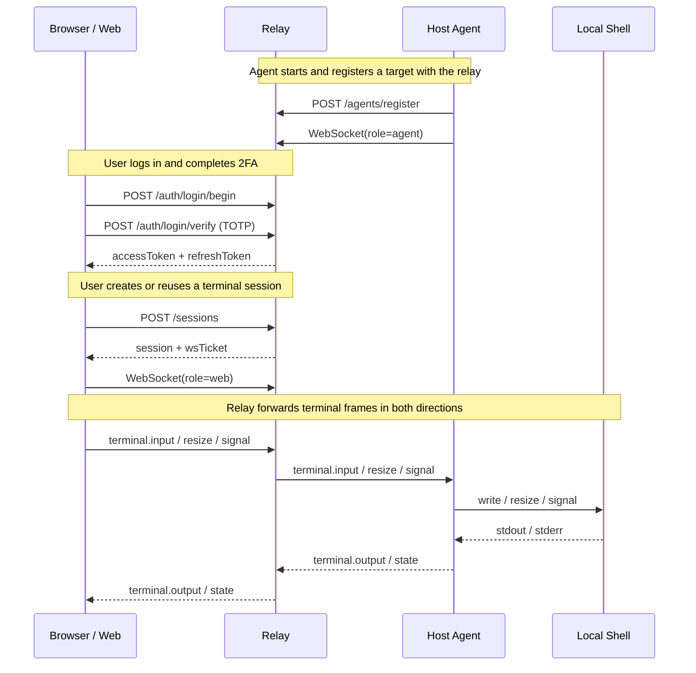

# CCMT

> A remote terminal control project that exposes a host shell to the browser through a relay service.

[中文 README](./README.md)

## Overview

CCMT is a `pnpm workspace` monorepo for remote terminal control. It separates terminal access into three independent but cooperating modules:

- `web`: the browser-based console
- `relay`: the authentication, session management, and forwarding layer
- `host-agent`: the terminal-side agent running on the target machine

The repository already provides a complete baseline flow: login, TOTP-based 2FA, target registration, session creation, WebSocket terminal forwarding, state persistence, and session recovery.

## Use Cases

CCMT is a good fit for scenarios such as:

- accessing a shell on a selected host from the browser
- adding a unified authentication and session-control layer in front of remote terminal access
- serving as a minimal runnable reference for a “Web Console + Relay + Agent” architecture
- evolving into a multi-target, multi-user, permission-aware remote operations console

## Key Features

- username / password + TOTP two-factor authentication
- first-time owner bootstrap flow
- TOTP QR code rendering
- access token / refresh token / WebSocket ticket auth chain
- persisted relay auth and session state
- persisted session scrollback with reconnect recovery
- host-agent publishing a local shell as a connectable target
- host-agent automatically retrying while relay is not ready yet
- browser terminal page with connection, reconnection, scrollback, and basic controls
- dashboard factory reset flow that returns to bootstrap
- bilingual UI support

## Architecture



## Quick Start

### 1. Requirements

Recommended versions:

- Node.js `20+`
- pnpm `10+`

If pnpm is not installed yet:

```bash
corepack enable
corepack prepare pnpm@10.30.3 --activate
```

### 2. Install dependencies

From the repository root:

```bash
pnpm install
```

### 3. Prepare environment variables

Copy the template:

```bash
cp .env.example .env
```

It is recommended to write `.env` in `export KEY=value` form and then load it directly:

```bash
source .env
```

If your `.env` still uses plain `KEY=value` lines, load it like this instead:

```bash
set -a
source .env
set +a
```

### 4. Start all services

```bash
pnpm dev
```

### 5. Open the web console

```text
http://localhost:3000
```

### 6. Recommended first-time flow

1. Open the login page.
2. Click “First time setup”.
3. Create the owner username and password.
4. Save the returned TOTP data and add it to an authenticator app.
5. Go through login using username, password, and a device label.
6. Enter the 6-digit TOTP code.
7. After login, enter the dashboard.
8. Open the terminal for the target you want.

## Local Development

### Start the whole project at once

```bash
pnpm install
cp .env.example .env
set -a
source .env
set +a
pnpm dev
```

### Start services separately

#### relay

```bash
set -a
source .env
set +a
pnpm --filter @ccmt/relay dev
```

#### host-agent

```bash
set -a
source .env
set +a
pnpm --filter @ccmt/host-agent dev
```

#### web

```bash
pnpm --filter @ccmt/web dev
```

Default endpoints:

- Web: `http://localhost:3000`
- Relay HTTP: `http://localhost:8787`
- Relay WebSocket: `ws://localhost:8787/ws`

## Module Guide

### `apps/web`

Responsible for:

- owner bootstrap
- login, TOTP verification, and token refresh
- displaying target / session / device data
- creating or reusing terminal sessions
- establishing the browser-side WebSocket terminal connection

### `apps/relay`

Responsible for:

- APIs such as `/auth/*`, `/targets`, `/sessions`, and `/agents/register`
- issuing and verifying user tokens, refresh tokens, WS tickets, and agent tokens
- managing target and session state
- storing scrollback
- persisting relay state to disk

Default state file:

```text
./.ccmt/relay-state.json
```

### `apps/host-agent`

Responsible for:

- registering with the relay using the enroll secret
- establishing the agent WebSocket connection
- spawning a local shell
- forwarding terminal output and receiving input / resize / signal events

The current implementation publishes one target by default:

- `CCMT_TARGET_ID`, default: `claude-main`
- `CCMT_SHELL`, default: `/bin/bash`

### `packages/protocol`

Responsible for:

- defining shared message frames
- standardizing terminal input / output / resize / signal / state / error message formats
- reducing protocol drift across web, relay, and host-agent

## Common Commands

From the repository root:

```bash
pnpm dev
pnpm build
pnpm typecheck
pnpm lint
pnpm test
```

Run a single workspace:

```bash
pnpm --filter @ccmt/web dev
pnpm --filter @ccmt/relay build
pnpm --filter @ccmt/host-agent typecheck
pnpm --filter @ccmt/protocol build
```

## Environment Variables

These are the main environment variables currently read by the code.

| Variable | Purpose | Default |
| --- | --- | --- |
| `CCMT_RELAY_PORT` | relay HTTP port | `8787` |
| `CCMT_WS_PATH` | relay WebSocket path | `/ws` |
| `CCMT_TOKEN_SECRET` | signing secret for user tokens and WS tickets | `ccmt-dev-secret` |
| `CCMT_AGENT_ENROLL_SECRET` | shared secret for host-agent registration | `ccmt-agent-enroll-dev` |
| `CCMT_RELAY_STATE_FILE` | relay persistence file path | `./.ccmt/relay-state.json` |
| `CCMT_RELAY_STATE_DEBOUNCE_MS` | debounce before relay state is persisted | `500` |
| `CCMT_WEB_RELAY_HTTP_URL` | relay HTTP URL used by host-agent | `http://localhost:8787` |
| `CCMT_WEB_RELAY_WS_URL` | relay WS URL used by host-agent | `ws://localhost:8787/ws` |
| `CCMT_AGENT_ID` | host-agent ID | `host-dev` |
| `CCMT_TARGET_ID` | published target ID | `claude-main` |
| `CCMT_SHELL` | local shell launched by host-agent | `/bin/bash` |
| `NEXT_PUBLIC_CCMT_RELAY_HTTP_URL` | relay HTTP URL used by the browser | `http://localhost:8787` |
| `NEXT_PUBLIC_CCMT_RELAY_WS_URL` | relay WS URL used by the browser | `ws://localhost:8787/ws` |

### Optional: seed an owner at startup

The current code also supports the following optional variables:

- `CCMT_OWNER_USERNAME`
- `CCMT_OWNER_PASSWORD`
- `CCMT_OWNER_TOTP_SECRET`

If all three are present, the relay creates an owner account automatically on startup.

## Deployment Notes

The following workflow comes from a deployment pattern that has already been run successfully:

- `web`: deployed to `your-server-host:3000`
- `relay`: deployed to `your-server-host:8787`
- `host-agent`: running on a local development machine and connecting to the cloud relay over the public network

### Deployment Topology

```text
browser -> cloud web:3000 -> cloud relay:8787 <- local host-agent
```

### 1. Deploy `web` and `relay` to the cloud server

#### 1) Sync the code to the server

Example target directory:

```text
/opt/ccmt/remote_claude
```

#### 2) Install Node / pnpm / dependencies

If the server does not have `pnpm`, install or enable it first, then run from the project root:

```bash
pnpm install
pnpm build
```

#### 3) Configure the relay environment file

Example file:

```text
/etc/ccmt/relay.env
```

Example contents:

```bash
CCMT_RELAY_PORT=8787
CCMT_WS_PATH=/ws
CCMT_TOKEN_SECRET=<your-random-secret>
CCMT_AGENT_ENROLL_SECRET=<your-random-enroll-secret>
CCMT_RELAY_STATE_FILE=/opt/ccmt/remote_claude/apps/relay/.ccmt/relay-state.json
CCMT_RELAY_STATE_DEBOUNCE_MS=500
```

#### 4) Configure the web environment file

Example file:

```text
/etc/ccmt/web.env
```

Example contents:

```bash
NEXT_PUBLIC_CCMT_RELAY_HTTP_URL=http://your-server-host:8787
NEXT_PUBLIC_CCMT_RELAY_WS_URL=ws://your-server-host:8787/ws
PORT=3000
HOSTNAME=0.0.0.0
```

#### 5) Start relay with systemd

Example file:

```text
/etc/systemd/system/ccmt-relay.service
```

Example contents:

```ini
[Unit]
Description=CCMT Relay
After=network.target

[Service]
Type=simple
WorkingDirectory=/opt/ccmt/remote_claude/apps/relay
EnvironmentFile=/etc/ccmt/relay.env
ExecStart=/opt/ccmt/remote_claude/apps/relay/node_modules/.bin/tsx /opt/ccmt/remote_claude/apps/relay/src/index.ts
Restart=always
RestartSec=3
User=root

[Install]
WantedBy=multi-user.target
```

Enable and start it:

```bash
systemctl daemon-reload
systemctl enable --now ccmt-relay.service
```

#### 6) Start web with systemd

Example file:

```text
/etc/systemd/system/ccmt-web.service
```

Adjust it based on the actual Node / pnpm paths on your server. The key point is to run Next.js in production mode on `0.0.0.0:3000`.

In this deployment model, the public endpoints are:

- Web: `http://your-server-host:3000`
- Relay HTTP: `http://your-server-host:8787`
- Relay WebSocket: `ws://your-server-host:8787/ws`

So the public web build-time environment variables should match those endpoints.

#### 6.1) A more robust web service pattern

Because `node`, `pnpm`, and `next` paths vary across servers, a more reliable `ccmt-web.service` pattern is usually:

- put `NEXT_PUBLIC_*`, `PORT`, and `HOSTNAME` in `EnvironmentFile`
- point `WorkingDirectory` to `apps/web`
- use the actual existing Node / pnpm / next paths in `ExecStart`

That makes `systemctl status` and `journalctl -u ccmt-web.service` much easier to use for troubleshooting.

#### 7) Health checks after cloud deployment

```bash
curl http://127.0.0.1:8787/health
curl http://your-server-host:8787/health
curl -I http://your-server-host:3000
```

### 2. Run `host-agent` locally against the cloud relay

Create a `.env` in the repository root. Using `export` form is recommended:

```bash
export CCMT_WEB_RELAY_HTTP_URL=http://your-server-host:8787
export CCMT_WEB_RELAY_WS_URL=ws://your-server-host:8787/ws
export CCMT_AGENT_ENROLL_SECRET=<same-enroll-secret-as-relay>
export CCMT_AGENT_ID=host-local
export CCMT_TARGET_ID=claude-local
export CCMT_SHELL=/bin/bash
```

Start it with:

```bash
cd /mnt/h/program/remote_claude
source .env
pnpm --dir apps/host-agent dev
```

If the connection is successful, the logs should look like:

```text
[host-agent] connecting
[host-agent] ready
```

## Operational Notes and Troubleshooting Experience

### 1. `source .env` was run, but host-agent still kept waiting for relay

Symptom:

```text
[host-agent] waiting for relay...
```

Cause:

- `.env` used plain `KEY=value`
- the current shell could see the values
- but child processes launched by `pnpm` did not necessarily inherit them
- `host-agent` fell back to the default `http://127.0.0.1:8787`

Fix:

- either write `.env` as `export KEY=value`
- or load it with:

```bash
set -a
source .env
set +a
```

### 2. The relay systemd unit pointed to the wrong `tsx` path

Symptom:

- `ccmt-relay.service` failed to start
- systemd returned `status=203/EXEC`

Cause:

- `ExecStart` pointed to a non-existent path:
  `/opt/ccmt/remote_claude/node_modules/.bin/tsx`
- the real executable was located at:
  `/opt/ccmt/remote_claude/apps/relay/node_modules/.bin/tsx`

Fix:

- update `ExecStart`
- run `systemctl daemon-reload`
- run `systemctl restart ccmt-relay.service`

### 3. A new enroll secret appeared to be configured, but relay still behaved as if it were using the old one

It is better to troubleshoot from runtime behavior rather than trusting the config file alone:

- call `/agents/register` directly for positive and negative tests
- try both the intended secret and the default secret
- verify actual service behavior, not just env file contents

## Troubleshooting

### No target appears in the browser

Check:

- whether the relay is running
- whether the host-agent is running
- whether `CCMT_AGENT_ENROLL_SECRET` matches on both sides
- whether the relay URLs are configured correctly

### Login works but terminal cannot be opened

Check:

- whether the target is online
- whether the current user has `terminal:write` permission
- whether the session was created successfully
- whether the browser is using the right relay HTTP / WS URLs

### Relay state disappears after restart

Check:

- whether `CCMT_RELAY_STATE_FILE` points to a writable location
- whether `.ccmt/relay-state.json` was deleted
- whether the relay exited before it could flush state

## Current Status

The repository already has a complete baseline flow, but it is still closer to an extensible MVP than a finished platform:

- `lint` and `test` are still placeholder scripts in most packages
- user and permission management are still basic
- host-agent currently publishes only a single shell target
- deployment, monitoring, and production configuration docs can still be improved

Natural next steps include:

- automated testing
- lint / formatting standards
- multi-target / multi-session support
- finer-grained permissions beyond viewer / owner
- more complete deployment and production guidance
