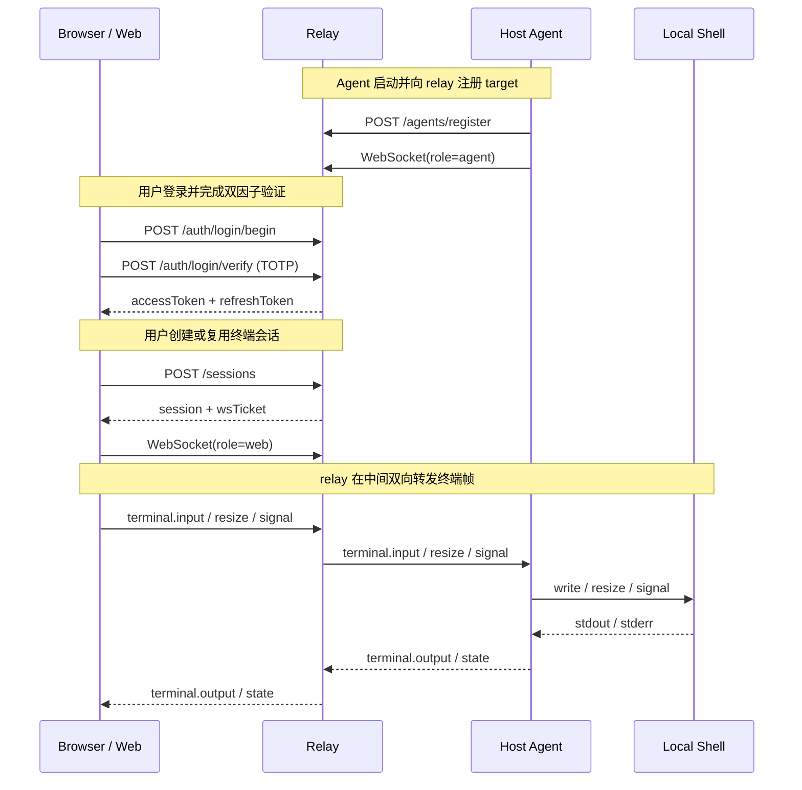

# CCMT

> 通过 relay 将主机 shell 安全暴露到浏览器中的远程终端控制项目。

[English README](./README.en.md)

## 概览

CCMT 是一个基于 `pnpm workspace` 的远程终端控制 monorepo，将一台主机上的终端能力拆分为三个独立但协作的模块：

- `web`：浏览器中的控制台界面
- `relay`：认证、会话管理与数据转发中继层
- `host-agent`：运行在目标主机上的终端代理

当前仓库已经打通完整的基础链路：登录、TOTP 双因子认证、target 注册、session 创建、WebSocket 终端转发、状态持久化与会话恢复。

## 适用场景

CCMT 适合用于以下场景：

- 在浏览器中访问指定主机上的 shell
- 为远程终端访问增加统一的认证与会话控制层
- 作为 “Web Console + Relay + Agent” 架构的最小可运行参考实现
- 继续扩展为多 target、多用户、多权限的远程运维控制台

## 核心特性

- 用户名 / 密码 + TOTP 双因子登录
- 首次 owner bootstrap 初始化流程
- TOTP 绑定二维码展示
- access token / refresh token / WebSocket ticket 认证链路
- relay 认证状态与会话状态持久化
- 会话 scrollback 持久化与重连恢复
- host-agent 将本地 shell 发布为可连接 target
- host-agent 在 relay 尚未就绪时自动重试
- 浏览器终端页面支持连接、重连、scrollback 与基础控制
- 仪表盘支持恢复出厂设置，并返回 bootstrap 流程
- 中英文双语界面

## 架构概览



## 快速开始

### 1. 环境要求

建议版本：

- Node.js `20+`
- pnpm `10+`

如果本机尚未安装 pnpm，可先执行：

```bash
corepack enable
corepack prepare pnpm@10.30.3 --activate
```

### 2. 安装依赖

在仓库根目录执行：

```bash
pnpm install
```

### 3. 准备环境变量

复制模板：

```bash
cp .env.example .env
```

推荐将 `.env` 写成 `export KEY=value` 形式，然后直接加载：

```bash
source .env
```

如果你的 `.env` 仍然是普通的 `KEY=value` 形式，则需要这样加载：

```bash
set -a
source .env
set +a
```

### 4. 启动全部服务

```bash
pnpm dev
```

### 5. 打开 Web 控制台

```text
http://localhost:3000
```

### 6. 首次使用建议流程

1. 打开登录页。
2. 点击“首次设置 / First time setup”。
3. 创建 owner 用户名和密码。
4. 保存页面返回的 TOTP 信息，并录入认证器。
5. 回到登录流程，输入用户名、密码和设备名称。
6. 输入 6 位 TOTP 验证码。
7. 登录后进入 dashboard。
8. 打开目标 target 对应的 terminal。

## 本地开发

### 一键启动整个项目

```bash
pnpm install
cp .env.example .env
set -a
source .env
set +a
pnpm dev
```

### 分别启动各服务

#### relay

```bash
set -a
source .env
set +a
pnpm --filter @ccmt/relay dev
```

#### host-agent

```bash
set -a
source .env
set +a
pnpm --filter @ccmt/host-agent dev
```

#### web

```bash
pnpm --filter @ccmt/web dev
```

默认地址：

- Web: `http://localhost:3000`
- Relay HTTP: `http://localhost:8787`
- Relay WebSocket: `ws://localhost:8787/ws`

## 模块说明

### `apps/web`

负责：

- owner bootstrap
- 登录、TOTP 验证与 token 刷新
- target / session / device 数据展示
- 创建或复用终端会话
- 建立浏览器侧 WebSocket 终端连接

### `apps/relay`

负责：

- `/auth/*`、`/targets`、`/sessions`、`/agents/register` 等接口
- user token / refresh token / ws ticket / agent token 的签发与校验
- target 与 session 状态管理
- scrollback 保存
- relay 状态落盘

默认状态文件：

```text
./.ccmt/relay-state.json
```

### `apps/host-agent`

负责：

- 使用 enroll secret 向 relay 注册
- 建立 agent WebSocket 连接
- 启动本地 shell
- 转发终端输出并接收 input / resize / signal 事件

当前实现默认发布一个 target：

- `CCMT_TARGET_ID`，默认值：`claude-main`
- `CCMT_SHELL`，默认值：`/bin/bash`

### `packages/protocol`

负责：

- 定义共享消息帧
- 统一 terminal input / output / resize / signal / state / error 消息结构
- 减少 web / relay / host-agent 三端协议漂移

## 常用命令

在仓库根目录执行：

```bash
pnpm dev
pnpm build
pnpm typecheck
pnpm lint
pnpm test
```

只运行某个 workspace：

```bash
pnpm --filter @ccmt/web dev
pnpm --filter @ccmt/relay build
pnpm --filter @ccmt/host-agent typecheck
pnpm --filter @ccmt/protocol build
```

## 环境变量

下面是当前代码里实际读取的主要环境变量。

| 变量名 | 作用 | 默认值 |
| --- | --- | --- |
| `CCMT_RELAY_PORT` | relay HTTP 端口 | `8787` |
| `CCMT_WS_PATH` | relay WebSocket 路径 | `/ws` |
| `CCMT_TOKEN_SECRET` | 用户 token / ws ticket 签名密钥 | `ccmt-dev-secret` |
| `CCMT_AGENT_ENROLL_SECRET` | host-agent 注册 relay 的共享密钥 | `ccmt-agent-enroll-dev` |
| `CCMT_RELAY_STATE_FILE` | relay 状态持久化文件 | `./.ccmt/relay-state.json` |
| `CCMT_RELAY_STATE_DEBOUNCE_MS` | relay 持久化 debounce 时间 | `500` |
| `CCMT_WEB_RELAY_HTTP_URL` | host-agent 调用 relay HTTP 的地址 | `http://localhost:8787` |
| `CCMT_WEB_RELAY_WS_URL` | host-agent 连接 relay WebSocket 的地址 | `ws://localhost:8787/ws` |
| `CCMT_AGENT_ID` | host-agent ID | `host-dev` |
| `CCMT_TARGET_ID` | 发布的 target ID | `claude-main` |
| `CCMT_SHELL` | host-agent 启动的本地 shell | `/bin/bash` |
| `NEXT_PUBLIC_CCMT_RELAY_HTTP_URL` | 浏览器访问 relay HTTP 的地址 | `http://localhost:8787` |
| `NEXT_PUBLIC_CCMT_RELAY_WS_URL` | 浏览器访问 relay WebSocket 的地址 | `ws://localhost:8787/ws` |

### 可选：启动时预置 owner

当前代码还支持以下可选变量：

- `CCMT_OWNER_USERNAME`
- `CCMT_OWNER_PASSWORD`
- `CCMT_OWNER_TOTP_SECRET`

如果三者同时存在，relay 启动时会自动创建一个 owner 用户。

## 部署实践

下面这套流程来自一次已经跑通的部署方案：

- `web`：部署到云服务器 `your-server-host:3000`
- `relay`：部署到云服务器 `your-server-host:8787`
- `host-agent`：运行在本地开发机，通过公网连接云端 relay

### 部署拓扑

```text
浏览器 -> 云端 web:3000 -> 云端 relay:8787 <- 本地 host-agent
```

### 1. 在云服务器部署 `web` 和 `relay`

#### 1) 同步代码到服务器

示例目标目录：

```text
/opt/ccmt/remote_claude
```

#### 2) 安装 Node / pnpm / 依赖

如果服务器没有 `pnpm`，先安装或启用它，然后在项目根目录执行：

```bash
pnpm install
pnpm build
```

#### 3) 配置 relay 环境文件

示例文件：

```text
/etc/ccmt/relay.env
```

示例内容：

```bash
CCMT_RELAY_PORT=8787
CCMT_WS_PATH=/ws
CCMT_TOKEN_SECRET=<your-random-secret>
CCMT_AGENT_ENROLL_SECRET=<your-random-enroll-secret>
CCMT_RELAY_STATE_FILE=/opt/ccmt/remote_claude/apps/relay/.ccmt/relay-state.json
CCMT_RELAY_STATE_DEBOUNCE_MS=500
```

#### 4) 配置 web 环境文件

示例文件：

```text
/etc/ccmt/web.env
```

示例内容：

```bash
NEXT_PUBLIC_CCMT_RELAY_HTTP_URL=http://your-server-host:8787
NEXT_PUBLIC_CCMT_RELAY_WS_URL=ws://your-server-host:8787/ws
PORT=3000
HOSTNAME=0.0.0.0
```

#### 5) 使用 systemd 启动 relay

示例文件：

```text
/etc/systemd/system/ccmt-relay.service
```

示例内容：

```ini
[Unit]
Description=CCMT Relay
After=network.target

[Service]
Type=simple
WorkingDirectory=/opt/ccmt/remote_claude/apps/relay
EnvironmentFile=/etc/ccmt/relay.env
ExecStart=/opt/ccmt/remote_claude/apps/relay/node_modules/.bin/tsx /opt/ccmt/remote_claude/apps/relay/src/index.ts
Restart=always
RestartSec=3
User=root

[Install]
WantedBy=multi-user.target
```

启用并启动：

```bash
systemctl daemon-reload
systemctl enable --now ccmt-relay.service
```

#### 6) 使用 systemd 启动 web

示例文件：

```text
/etc/systemd/system/ccmt-web.service
```

实际可按你服务器上的 Node / pnpm 路径调整，核心是让 Next.js 以生产模式监听 `0.0.0.0:3000`。

本次部署模型中的公网地址为：

- Web: `http://your-server-host:3000`
- Relay HTTP: `http://your-server-host:8787`
- Relay WebSocket: `ws://your-server-host:8787/ws`

因此 web 构建时使用的公网环境变量也应与上面保持一致。

#### 6.1) 更稳妥的 web service 写法

由于不同服务器上的 `node`、`pnpm`、`next` 路径可能不同，`ccmt-web.service` 更稳妥的模式通常是：

- 在 `EnvironmentFile` 中放 `NEXT_PUBLIC_*`、`PORT`、`HOSTNAME`
- `WorkingDirectory` 指向 `apps/web`
- `ExecStart` 使用服务器上真实存在的 Node / pnpm / next 路径

这样出现问题时，更容易直接使用 `systemctl status` 与 `journalctl -u ccmt-web.service` 排查。

#### 7) 云端部署完成后的验活

```bash
curl http://127.0.0.1:8787/health
curl http://your-server-host:8787/health
curl -I http://your-server-host:3000
```

### 2. 在本地运行 `host-agent` 连接云端 relay

在仓库根目录创建 `.env`，推荐直接使用 `export` 形式：

```bash
export CCMT_WEB_RELAY_HTTP_URL=http://your-server-host:8787
export CCMT_WEB_RELAY_WS_URL=ws://your-server-host:8787/ws
export CCMT_AGENT_ENROLL_SECRET=<same-enroll-secret-as-relay>
export CCMT_AGENT_ID=host-local
export CCMT_TARGET_ID=claude-local
export CCMT_SHELL=/bin/bash
```

启动方式：

```bash
cd /mnt/h/program/remote_claude
source .env
pnpm --dir apps/host-agent dev
```

如果连接成功，日志应类似：

```text
[host-agent] connecting
[host-agent] ready
```

## 运维与排错经验

### 1. `source .env` 了，但 host-agent 仍然一直等待 relay

现象：

```text
[host-agent] waiting for relay...
```

原因：

- `.env` 里是普通 `KEY=value`
- 当前 shell 虽然能读到变量
- 但 `pnpm` 启动出来的子进程不一定继承这些未导出的变量
- `host-agent` 最终回退到默认地址 `http://127.0.0.1:8787`

解决方式：

- 要么把 `.env` 写成 `export KEY=value`
- 要么使用：

```bash
set -a
source .env
set +a
```

### 2. 云端 relay 的 systemd 指向了错误的 `tsx` 路径

现象：

- `ccmt-relay.service` 启动失败
- systemd 返回 `status=203/EXEC`

原因：

- `ExecStart` 指向了不存在的路径：
  `/opt/ccmt/remote_claude/node_modules/.bin/tsx`
- 实际可执行文件位于：
  `/opt/ccmt/remote_claude/apps/relay/node_modules/.bin/tsx`

解决方式：

- 修改 `ExecStart`
- 执行 `systemctl daemon-reload`
- 执行 `systemctl restart ccmt-relay.service`

### 3. 看起来已经写入了新的 enroll secret，但 relay 仍然按旧值工作

建议直接从运行结果排查，而不是只看配置文件内容：

- 直接请求 `/agents/register` 做正反测试
- 分别试目标 secret 与默认 secret
- 不只检查 env 文件内容，也要验证服务运行时的真实行为

## 排查建议

### 浏览器里看不到 target

检查：

- relay 是否正在运行
- host-agent 是否已经启动
- 两边 `CCMT_AGENT_ENROLL_SECRET` 是否一致
- relay 地址配置是否正确

### 登录正常但打不开终端

检查：

- target 是否在线
- 当前用户是否具有 `terminal:write` 权限
- session 是否创建成功
- 浏览器使用的 relay HTTP / WS 地址是否正确

### relay 重启后状态丢失

检查：

- `CCMT_RELAY_STATE_FILE` 是否指向可写路径
- `.ccmt/relay-state.json` 是否被删除
- relay 是否在退出前来不及 flush 状态

## 当前状态

这个仓库已经具备完整的基础链路，但当前仍然更接近一个可扩展的 MVP：

- `lint` 与 `test` 在多数包中仍是占位脚本
- 用户与权限管理仍较基础
- host-agent 当前只发布单一 shell target
- 部署、监控与生产化配置说明仍可继续完善

如果继续演进，比较自然的方向包括：

- 自动化测试
- lint / formatting 规范
- 多 target / 多 session 支持
- 比 viewer / owner 更细粒度的权限模型
- 更完整的部署与生产环境配置
