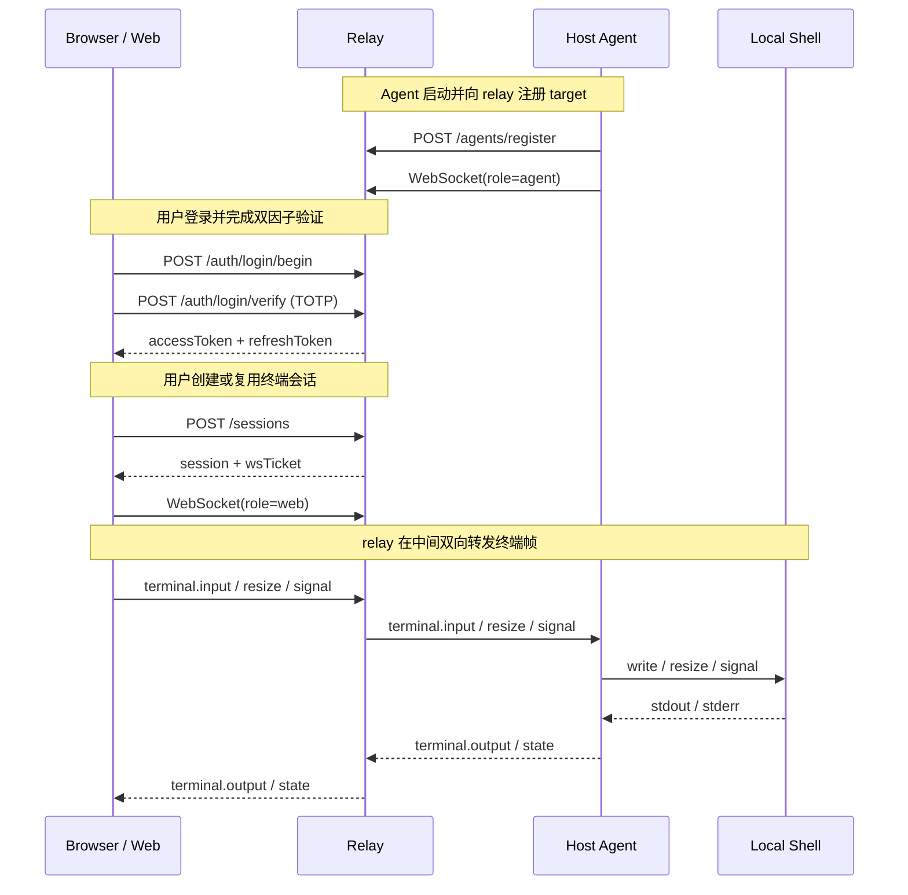

# CCMT

> 通过 relay 将主机 shell 安全暴露到浏览器中的远程终端控制项目。

[English README](./README.en.md)

## CCMT 是什么

CCMT 是一个基于 `pnpm workspace` 的远程终端控制 monorepo，目标是把一台主机上的终端能力拆成 3 个部分：

- `web`：浏览器里的控制台
- `relay`：负责认证、会话和转发的中继层
- `host-agent`：运行在目标主机上的终端代理

当前仓库已经把这条链路的基础版本串起来：登录、TOTP 双因子认证、target 注册、session 创建、WebSocket 终端转发、状态持久化都已接入。

## 适合用来做什么

- 在浏览器里访问指定主机上的 shell
- 给远程终端能力做一层统一的认证与会话控制
- 作为“Web 控制台 + relay + agent”架构的最小可运行参考实现
- 继续扩展成多 target、多用户、多权限的远程运维控制台

## 当前亮点

- 用户名 / 密码 + TOTP 双因子登录
- 首次 owner bootstrap
- access token / refresh token / WebSocket ticket 认证流
- relay 持久化认证状态与会话状态
- host-agent 将本地 shell 暴露为可连接 target
- Web 终端页面支持连接、重连、scrollback 和基础控制
- 中英文界面切换


## 端到端流程图



## 快速开始

### 1) 环境要求

建议使用：

- Node.js `20+`
- pnpm `10+`

如果本机没有 pnpm，可以先执行：

```bash
corepack enable
corepack prepare pnpm@10.30.3 --activate
```

### 2) 安装依赖

在仓库根目录执行：

```bash
pnpm install
```

### 3) 准备环境变量

复制模板：

```bash
cp .env.example .env
```

然后把变量导出到当前 shell：

```bash
set -a
source .env
set +a
```

### 4) 启动全部服务

```bash
pnpm dev
```

### 5) 打开 Web 控制台

```text
http://localhost:3000
```

### 6) 首次使用建议流程

1. 打开登录页。
2. 点击“首次设置 / First time setup”。
3. 创建 owner 用户名和密码。
4. 保存页面返回的 TOTP 信息，并录入认证器。
5. 回到登录流程，输入用户名、密码和设备名称。
6. 输入 6 位 TOTP 验证码。
7. 登录后进入 dashboard。
8. 打开 target 对应的 terminal。

## 安装与启动说明

### 一键启动整个项目

```bash
pnpm install
cp .env.example .env
set -a
source .env
set +a
pnpm dev
```

### 分别启动各服务

#### relay

```bash
set -a
source .env
set +a
pnpm --filter @ccmt/relay dev
```

#### host-agent

```bash
set -a
source .env
set +a
pnpm --filter @ccmt/host-agent dev
```

#### web

```bash
pnpm --filter @ccmt/web dev
```

默认地址：

- Web: `http://localhost:3000`
- Relay HTTP: `http://localhost:8787`
- Relay WebSocket: `ws://localhost:8787/ws`

## 一个需要特别注意的点

当前代码里：

- `apps/relay`
- `apps/host-agent`

都是直接读取 `process.env`，**不会自动加载仓库根目录的 `.env` 文件**。

所以如果你只是执行了 `cp .env.example .env`，但没有把变量 `source` 到当前 shell，relay 和 host-agent 依然读不到这些值。

这也是为什么 README 里把下面这段命令单独强调出来：

```bash
set -a
source .env
set +a
```

## 模块说明

### `apps/web`

负责：

- owner bootstrap
- 登录、TOTP 验证、token 刷新
- target / session / device 数据展示
- 创建或复用终端会话
- 通过 WebSocket 建立浏览器终端连接

### `apps/relay`

负责：

- `/auth/*`、`/targets`、`/sessions`、`/agents/register` 等接口
- user token / refresh token / ws ticket / agent token 的签发与校验
- target 与 session 的状态管理
- scrollback 保存
- relay 状态落盘

默认状态文件：

```text
./.ccmt/relay-state.json
```

### `apps/host-agent`

负责：

- 使用 enroll secret 向 relay 注册
- 建立 agent WebSocket 连接
- 启动本地 shell
- 转发终端输出并接收输入 / resize / signal

当前实现默认发布一个 target：

- `CCMT_TARGET_ID`，默认值：`claude-main`
- `CCMT_SHELL`，默认值：`/bin/bash`

### `packages/protocol`

负责：

- 定义共享消息帧
- 统一 terminal input / output / resize / signal / state / error 消息结构
- 减少 web / relay / host-agent 三端协议漂移

## 常用命令

在仓库根目录执行：

```bash
pnpm dev
pnpm build
pnpm typecheck
pnpm lint
pnpm test
```

只运行某个 workspace：

```bash
pnpm --filter @ccmt/web dev
pnpm --filter @ccmt/relay build
pnpm --filter @ccmt/host-agent typecheck
pnpm --filter @ccmt/protocol build
```

## 环境变量

下面是当前代码里实际读取的主要环境变量。

| 变量名 | 作用 | 默认值 |
| --- | --- | --- |
| `CCMT_RELAY_PORT` | relay HTTP 端口 | `8787` |
| `CCMT_WS_PATH` | relay WebSocket 路径 | `/ws` |
| `CCMT_TOKEN_SECRET` | 用户 token / ws ticket 签名密钥 | `ccmt-dev-secret` |
| `CCMT_AGENT_ENROLL_SECRET` | host-agent 注册 relay 的共享密钥 | `ccmt-agent-enroll-dev` |
| `CCMT_RELAY_STATE_FILE` | relay 状态持久化文件 | `./.ccmt/relay-state.json` |
| `CCMT_RELAY_STATE_DEBOUNCE_MS` | relay 持久化 debounce 时间 | `500` |
| `CCMT_WEB_RELAY_HTTP_URL` | host-agent 调用 relay HTTP 的地址 | `http://localhost:8787` |
| `CCMT_WEB_RELAY_WS_URL` | host-agent 连接 relay WebSocket 的地址 | `ws://localhost:8787/ws` |
| `CCMT_AGENT_ID` | host-agent ID | `host-dev` |
| `CCMT_TARGET_ID` | 发布的 target ID | `claude-main` |
| `CCMT_SHELL` | host-agent 启动的本地 shell | `/bin/bash` |
| `NEXT_PUBLIC_CCMT_RELAY_HTTP_URL` | 浏览器访问 relay HTTP 的地址 | `http://localhost:8787` |
| `NEXT_PUBLIC_CCMT_RELAY_WS_URL` | 浏览器访问 relay WebSocket 的地址 | `ws://localhost:8787/ws` |

### 可选：启动时预置 owner

当前代码还支持这三个可选变量：

- `CCMT_OWNER_USERNAME`
- `CCMT_OWNER_PASSWORD`
- `CCMT_OWNER_TOTP_SECRET`

如果三者同时存在，relay 启动时会自动创建一个 owner 用户。

## 仓库结构

```text
.
├── apps/
│   ├── host-agent/
│   ├── relay/
│   └── web/
├── packages/
│   └── protocol/
├── .env.example
├── .gitignore
├── package.json
├── pnpm-lock.yaml
├── pnpm-workspace.yaml
├── tsconfig.base.json
├── README.md
└── README.en.md
```

## 排查建议

### 浏览器里看不到 target

检查：

- relay 是否启动
- host-agent 是否启动
- 两边 `CCMT_AGENT_ENROLL_SECRET` 是否一致
- relay 地址是否配对正确

### 登录正常但打不开终端

检查：

- target 是否在线
- 当前用户是否有 `terminal:write` 权限
- session 是否创建成功
- 浏览器使用的 relay HTTP / WS 地址是否正确

### relay 重启后状态丢失

检查：

- `CCMT_RELAY_STATE_FILE` 是否可写
- `.ccmt/relay-state.json` 是否被删除
- relay 是否在异常退出前来不及 flush 状态

## 当前状态

这个仓库已经具备完整的基础链路，但仍然更接近一个可扩展的 MVP：

- `lint` 和 `test` 目前多数包还是占位脚本
- 用户和权限管理仍比较基础
- host-agent 当前只发布单一 shell target
- 还缺少更完整的部署、监控和生产配置说明

如果接下来继续完善，比较自然的方向包括：

- 自动化测试
- lint / formatting 规范
- 多 target / 多 session 支持
- viewer / owner 之外更细粒度权限模型
- 部署与生产环境配置
